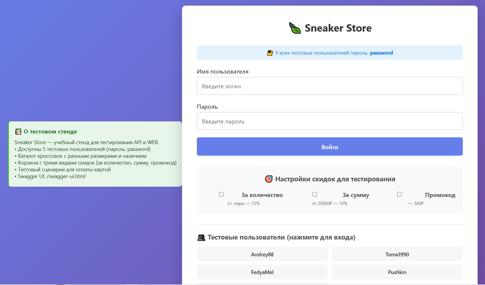

# UI Test Sneaker Store

Автотесты для интернет-магазина кроссовок с использованием Selenide и Allure.  
В данный момент магазин находится по адресу http://83.166.244.182:8081/login.html?clear=true


## 📋 О проекте

Проект содержит автоматизированные UI-тесты для проверки функциональности интернет-магазина кроссовок. Тесты покрывают сценарии покупки, проверку скидок, валидацию платежных данных и обработку ошибок.

## 🛠 Технологии

| Технология | Версия | Назначение |
|------------|--------|------------|
| Java | 21 | Язык программирования |
| Selenide | 7.8.1 | Фреймворк для UI-тестирования |
| JUnit 5 | 5.10.2 | Тестовый фреймворк |
| Allure | 2.29.0 | Формирование отчетов |
| AssertJ | 3.27.7 | Assertions |
| Lombok | - | Упрощение кода |
| WebDriverManager | 6.1.0 | Управление драйверами браузера |

## 📁 Структура проекта

```
src/test/java/ru/sneakerstore/
├── config/
│   └── BaseSelenideTest.java      # Базовый класс с настройками
├── pages/                          # Page Object Model
│   ├── BasePage.java               # Абстрактный базовый класс
│   ├── LoginPage.java              # Страница авторизации
│   ├── CatalogPage.java            # Каталог товаров
│   ├── CartPage.java               # Корзина
│   ├── NavBarPage.java             # Навигационная панель
│   ├── PaymentPage.java            # Страница оплаты
│   └── PaymentSuccessPage.java     # Страница успешной оплаты
└── tests/
    └── UserJourneyTest.java        # Тестовые сценарии
```

## 🚀 Запуск тестов

### Предварительные требования
- Java 21
- Gradle (встроенный в проект)

### Команды

```bash
# Запуск всех тестов
./gradlew test

# Запуск с перезапуском (очистка перед запуском)
./gradlew clean test

# Запуск конкретного теста
./gradlew test --tests "UserJourneyTest.happyPathQualityPurchase"
```

## 📊 Отчеты Allure

### Генерация и просмотр отчета

```bash
# Сгенерировать отчет
./gradlew allureReport

# Открыть отчет в браузере
./gradlew allureServe
```

### Особенности отчета
- Скриншоты при падении тестов
- Сохранение HTML-кода страницы
- Детальные шаги с логированием
- Вложения с ошибками

## 🧪 Тестовые сценарии

| Порядок | Название | Описание |
|---------|----------|----------|
| 1 | Проверка недостатка товара | Добавление товара в количестве больше доступного |
| 2 | Покупка со скидкой за количество | 3 товара, скидка 15% |
| 3 | Покупка со скидкой за сумму | Сумма >20000 руб, скидка 10% |
| 4 | Покупка с обеими скидками | Количество 3 + сумма >20000 руб, максимальная скидка 25% |
| 5 | Проверка оплаты | Валидация различных вариантов карт |
| 10 | Отмена заказа | Возврат в корзину после перехода к оплате |

## 🔧 Конфигурация

### gradle.properties
```properties
selenideVersion=7.8.1
allureVersion=2.29.0
webDriverManagerVersion=6.1.0
```

### selenide.properties
```properties
selenide.baseUrl=http://83.166.244.182:8081
selenide.browser=chrome
selenide.browserSize=1920x1080
selenide.timeout=10000
selenide.screenshots=true
selenide.savePageSource=true
```

## 📝 Тестовые данные

### Пользователи
| Логин | Скидки |
|-------|--------|
| FedyaMel | Количественная + Суммовая |
| AdaLovelace | Только количественная |

### Тестовые карты
| Номер карты | Результат |
|-------------|-----------|
| 4111111111111111 | Успешная оплата |
| 0000000000000000 | Карта заблокирована |
| 1234567890123456 | Недостаточно средств |

## 🏗 Архитектура

### Page Object Model
Каждая страница представлена отдельным классом:
- **BasePage** - общие методы (открытие страницы, ожидание)
- **Конкретные страницы** - локаторы и методы взаимодействия

### Базовый класс BaseSelenideTest
- Настройка WebDriver
- Автоматическое прикрепление скриншотов в Allure
- Управление жизненным циклом браузера

### Параллельный запуск
Настроен параллельный запуск тестов с фиксированным количеством потоков (2) через `junit-platform.properties`

